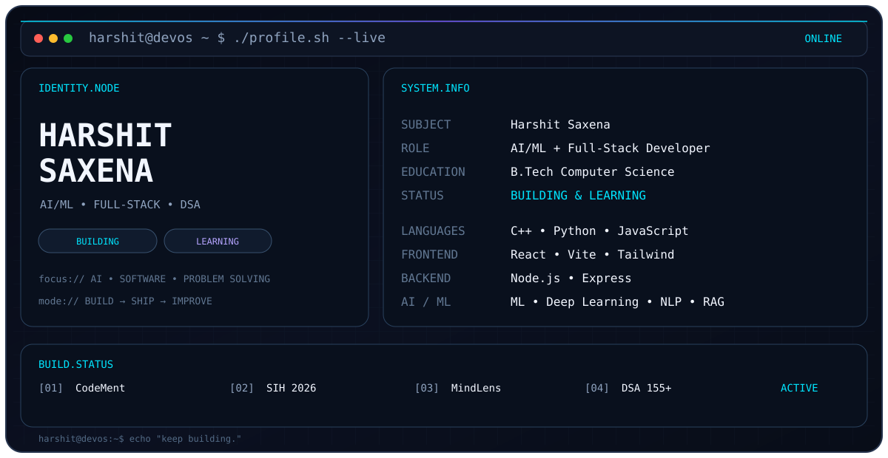

---

## `> whoami`

I'm a Computer Science student and developer focused on **AI/ML, full-stack development, and problem solving**.

I learn by building practical products and improving my engineering fundamentals.

---

## `PROJECTS.EXECUTING`

<table>

<tr>
<td width="50%" valign="top">

### 🧠 MindLens

**AI Student Wellbeing Analyzer**

AI-powered analysis combining sentiment analysis, computer vision, and predictive modelling.

**Stack:** `Python` `OpenCV` `Transformers` `ML`

</td>

<td width="50%" valign="top">

### 💻 HarshitOS

**Personal Developer Portfolio**

A futuristic developer portfolio focused on projects, engineering work, and interactive UI.

**Stack:** `React` `Vite` `JavaScript`

</td>
</tr>
</table>

---
