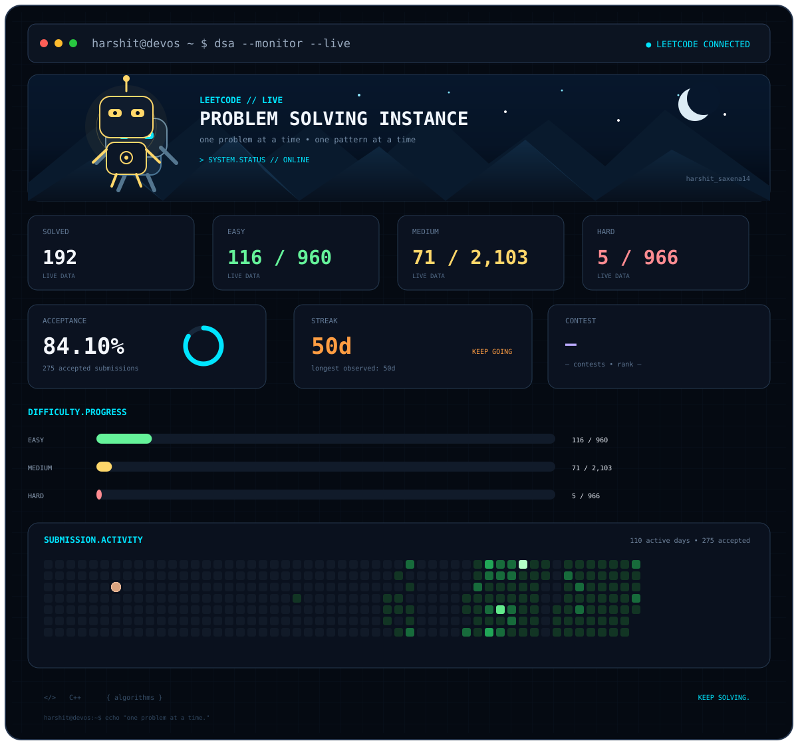

---

## `> whoami`

I'm a Computer Science student and developer focused on **AI/ML, full-stack development, and problem solving**.

I learn by building practical products and improving my engineering fundamentals.

---

## `PROJECTS.EXECUTING`

<table>
<tr>
<td width="50%" valign="top">

### 🚀 CodeMent

**DSA Learning Platform**

A structured DSA platform featuring personalized roadmaps, progress tracking, weak-topic detection, AI mentor capabilities, and LeetCode integration.

**Stack:** `React` `Node.js` `Express` `MongoDB`

</td>

<td width="50%" valign="top">

### 🤖 SIH 2026

**AI Government / Citizen Assistant**

A multilingual, voice-first assistant for government scheme discovery, eligibility, applications, and grievance registration/tracking.

**Stack:** `AI` `RAG` `NLP` `Voice AI`

</td>
</tr>

<tr>
<td width="50%" valign="top">

### 🧠 MindLens

**AI Student Wellbeing Analyzer**

AI-powered analysis combining sentiment analysis, computer vision, and predictive modelling.

**Stack:** `Python` `OpenCV` `Transformers` `ML`

</td>

<td width="50%" valign="top">

### 💻 HarshitOS

**Personal Developer Portfolio**

A futuristic developer portfolio focused on projects, engineering work, and interactive UI.

**Stack:** `React` `Vite` `JavaScript`

</td>
</tr>
</table>

---

## `> dsa --monitor`

### `LEETCODE // LIVE`

